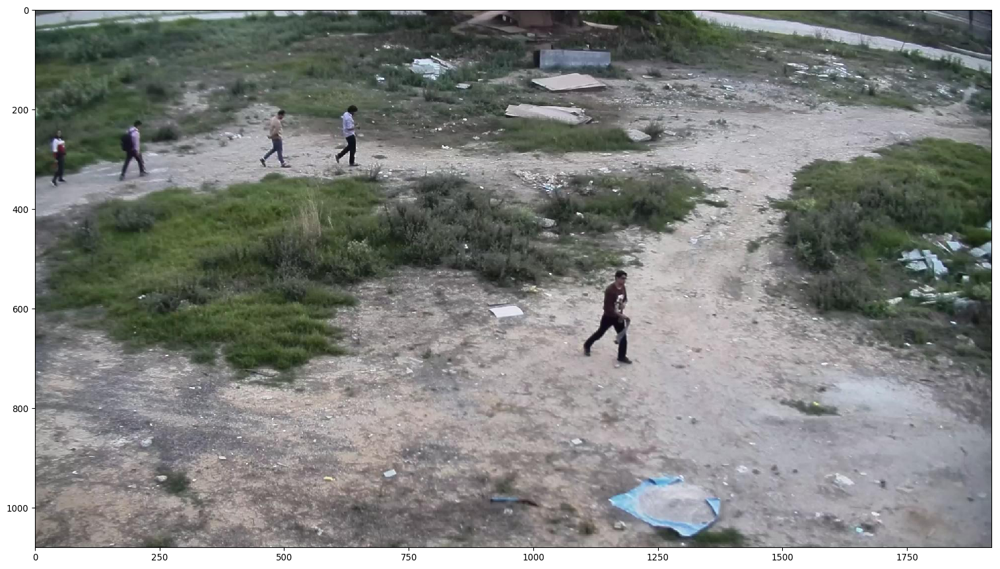
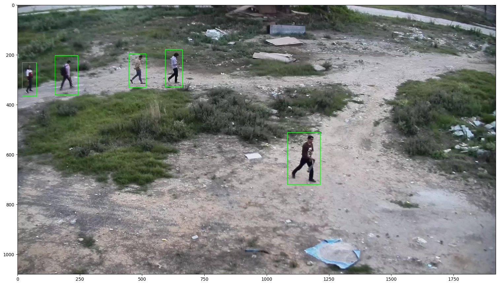
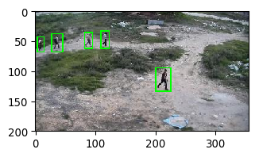
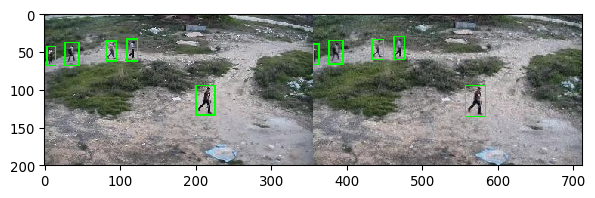
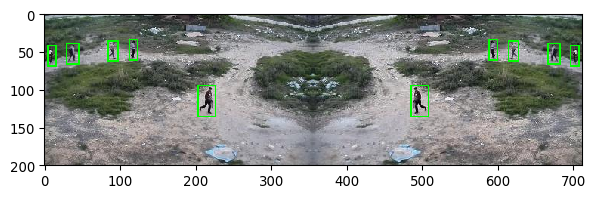
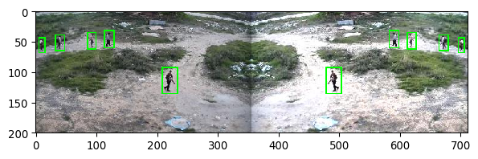

# Object Detection - Pre Processing
- Convert XML attributes to CSV
- Visualize Image with Boxes
- Bounding Box Image Resize
- Augumentation of Images with bounding box.


```python
# Import all required libraries in advance
import imgaug as ia
ia.seed(1)
# imgaug uses matplotlib backend for displaying images
%matplotlib inline
from imgaug.augmentables.bbs import BoundingBox, BoundingBoxesOnImage
from imgaug import augmenters as iaa 
# imageio library will be used for image input/output
import imageio
import pandas as pd
import numpy as np
import re
import os
import glob
# this library is needed to read XML files for converting it into CSV
import xml.etree.ElementTree as ET
import shutil
```

## Images, XML files, bounding boxes


```python
# load images as NumPy arrays and append them to images list
images = []
for index, file in enumerate(glob.glob('short_data_original/*.jpg')):
    images.append(imageio.imread(file))
    
# how many images we have
print('We have {} images'.format(len(images)))
```

    We have 5 images
    


```python
# what are the sizes of the images
for index, file in enumerate(glob.glob('short_data_original/*.jpg')):
    print('Image {} have size of {}'.format(file[7:], images[index].shape))
```

    Image ata_original\Image13731.jpg have size of (1080, 1920, 3)
    Image ata_original\Image13732.jpg have size of (1080, 1920, 3)
    Image ata_original\Image13733.jpg have size of (1080, 1920, 3)
    Image ata_original\Image13734.jpg have size of (1080, 1920, 3)
    Image ata_original\Image13735.jpg have size of (1080, 1920, 3)
    


```python
#look at some 2 random images
ia.imshow(images[1])
ia.imshow(images[4])
```





```python
# XML file names correspond to the image file names
for index, file in enumerate(glob.glob('short_data_original/*.xml')):
    print(file)
```

    short_data_original\Image13731.xml
    short_data_original\Image13732.xml
    short_data_original\Image13733.xml
    short_data_original\Image13734.xml
    short_data_original\Image13735.xml
    


```python
# have a look how one of the XML annotation file looks like
# notice how it has 2 bounding boxes with red pandas
shutil.copy('short_data_original\Image13731.xml', 'Sample-Image13731.txt')
annotation_text = open("Sample-Image13731.txt", "r")
print(annotation_text.read())
annotation_text.close()
```

    <annotation>
      <folder/>
      <filename>Image13731.jpg</filename>
      <database/>
      <annotation/>
      <image/>
      <size>
        <height>1080</height>
        <width>1920</width>
        <depth>3</depth>
      </size>
      <segmented/>
      <object>
        <name>person</name>
        <pose/>
        <truncated/>
        <difficult/>
        <bndbox>
          <xmin>1088.4444444444443</xmin>
          <ymin>513.1851851851851</ymin>
          <xmax>1199.5555555555554</xmax>
          <ymax>707.6296296296296</ymax>
        </bndbox>
      </object>
      <object>
        <name>person</name>
        <pose/>
        <truncated/>
        <difficult/>
        <bndbox>
          <xmin>584.7407407407406</xmin>
          <ymin>192.81481481481478</ymin>
          <xmax>655.1111111111111</xmax>
          <ymax>320.59259259259255</ymax>
        </bndbox>
      </object>
      <object>
        <name>person</name>
        <pose/>
        <truncated/>
        <difficult/>
        <bndbox>
          <xmin>438.4444444444444</xmin>
          <ymin>196.51851851851848</ymin>
          <xmax>518.074074074074</xmax>
          <ymax>326.1481481481481</ymax>
        </bndbox>
      </object>
      <object>
        <name>person</name>
        <pose/>
        <truncated/>
        <difficult/>
        <bndbox>
          <xmin>153.25925925925924</xmin>
          <ymin>207.62962962962962</ymin>
          <xmax>238.44444444444443</xmax>
          <ymax>353.9259259259259</ymax>
        </bndbox>
      </object>
      <object>
        <name>person</name>
        <pose/>
        <truncated/>
        <difficult/>
        <bndbox>
          <xmin>23.629629629629626</xmin>
          <ymin>237.25925925925924</ymin>
          <xmax>68.07407407407408</xmax>
          <ymax>357.6296296296296</ymax>
        </bndbox>
      </object>
    </annotation>
    
    

## Convert all XML files into one CSV file that we can feed into TensorFlow Object Detection


```python
# Function that will extract column data for our CSV file
def xml_to_csv(path):
    xml_list = []
    for xml_file in glob.glob(path + '/*.xml'):
        tree = ET.parse(xml_file)
        root = tree.getroot()
        for member in root.findall('object'):
            value = (root.find('filename').text,
                     int(root.find('size')[0].text),
                     int(root.find('size')[1].text),
                     member[0].text,
                     int(member[4][0].text.split(".")[0])+1,
                     int(member[4][1].text.split(".")[0])+1,
                     int(member[4][2].text.split(".")[0])+1,
                     int(member[4][3].text.split(".")[0])+1
                     )
            xml_list.append(value)
    column_name = ['filename', 'width', 'height', 'class', 'xmin', 'ymin', 'xmax', 'ymax']
    xml_df = pd.DataFrame(xml_list, columns=column_name)
    return xml_df
```


```python
# apply xml_to_csv() function to convert all XML files in images/ folder into labels.csv
labels_df = xml_to_csv('short_data_original/')
labels_df.to_csv(('ShortDatasetComplete.csv'), index=None)
print('Successfully converted xml to csv.')
```

    Successfully converted xml to csv.
    


```python
labels_df.head(10)
```


<div>
<style scoped>
    .dataframe tbody tr th:only-of-type {
        vertical-align: middle;
    }

    .dataframe tbody tr th {
        vertical-align: top;
    }

    .dataframe thead th {
        text-align: right;
    }
</style>
<table border="1" class="dataframe">
  <thead>
    <tr style="text-align: right;">
      <th></th>
      <th>filename</th>
      <th>width</th>
      <th>height</th>
      <th>class</th>
      <th>xmin</th>
      <th>ymin</th>
      <th>xmax</th>
      <th>ymax</th>
    </tr>
  </thead>
  <tbody>
    <tr>
      <th>0</th>
      <td>Image13731.jpg</td>
      <td>1080</td>
      <td>1920</td>
      <td>person</td>
      <td>1089</td>
      <td>514</td>
      <td>1200</td>
      <td>708</td>
    </tr>
    <tr>
      <th>1</th>
      <td>Image13731.jpg</td>
      <td>1080</td>
      <td>1920</td>
      <td>person</td>
      <td>585</td>
      <td>193</td>
      <td>656</td>
      <td>321</td>
    </tr>
    <tr>
      <th>2</th>
      <td>Image13731.jpg</td>
      <td>1080</td>
      <td>1920</td>
      <td>person</td>
      <td>439</td>
      <td>197</td>
      <td>519</td>
      <td>327</td>
    </tr>
    <tr>
      <th>3</th>
      <td>Image13731.jpg</td>
      <td>1080</td>
      <td>1920</td>
      <td>person</td>
      <td>154</td>
      <td>208</td>
      <td>239</td>
      <td>354</td>
    </tr>
    <tr>
      <th>4</th>
      <td>Image13731.jpg</td>
      <td>1080</td>
      <td>1920</td>
      <td>person</td>
      <td>24</td>
      <td>238</td>
      <td>69</td>
      <td>358</td>
    </tr>
    <tr>
      <th>5</th>
      <td>Image13732.jpg</td>
      <td>1080</td>
      <td>1920</td>
      <td>person</td>
      <td>593</td>
      <td>180</td>
      <td>661</td>
      <td>327</td>
    </tr>
    <tr>
      <th>6</th>
      <td>Image13732.jpg</td>
      <td>1080</td>
      <td>1920</td>
      <td>person</td>
      <td>1083</td>
      <td>512</td>
      <td>1213</td>
      <td>719</td>
    </tr>
    <tr>
      <th>7</th>
      <td>Image13732.jpg</td>
      <td>1080</td>
      <td>1920</td>
      <td>person</td>
      <td>446</td>
      <td>197</td>
      <td>515</td>
      <td>330</td>
    </tr>
    <tr>
      <th>8</th>
      <td>Image13732.jpg</td>
      <td>1080</td>
      <td>1920</td>
      <td>person</td>
      <td>150</td>
      <td>204</td>
      <td>241</td>
      <td>360</td>
    </tr>
    <tr>
      <th>9</th>
      <td>Image13732.jpg</td>
      <td>1080</td>
      <td>1920</td>
      <td>person</td>
      <td>19</td>
      <td>232</td>
      <td>76</td>
      <td>364</td>
    </tr>
  </tbody>
</table>
</div>


##  Resize all images together with the corresponding object bounding boxes


```python
# start by groupping each image bounding boxes coordinates
# separate dataframes are formed based on the filename
grouped = labels_df.groupby('filename')
```


```python
# we can pull each group with get_group() using the filename
group_df = grouped.get_group('Image13732.jpg')
group_df = group_df.reset_index()
group_df = group_df.drop(['index'], axis=1)
group_df
```


<div>
<style scoped>
    .dataframe tbody tr th:only-of-type {
        vertical-align: middle;
    }

    .dataframe tbody tr th {
        vertical-align: top;
    }

    .dataframe thead th {
        text-align: right;
    }
</style>
<table border="1" class="dataframe">
  <thead>
    <tr style="text-align: right;">
      <th></th>
      <th>filename</th>
      <th>width</th>
      <th>height</th>
      <th>class</th>
      <th>xmin</th>
      <th>ymin</th>
      <th>xmax</th>
      <th>ymax</th>
    </tr>
  </thead>
  <tbody>
    <tr>
      <th>0</th>
      <td>Image13732.jpg</td>
      <td>1080</td>
      <td>1920</td>
      <td>person</td>
      <td>593</td>
      <td>180</td>
      <td>661</td>
      <td>327</td>
    </tr>
    <tr>
      <th>1</th>
      <td>Image13732.jpg</td>
      <td>1080</td>
      <td>1920</td>
      <td>person</td>
      <td>1083</td>
      <td>512</td>
      <td>1213</td>
      <td>719</td>
    </tr>
    <tr>
      <th>2</th>
      <td>Image13732.jpg</td>
      <td>1080</td>
      <td>1920</td>
      <td>person</td>
      <td>446</td>
      <td>197</td>
      <td>515</td>
      <td>330</td>
    </tr>
    <tr>
      <th>3</th>
      <td>Image13732.jpg</td>
      <td>1080</td>
      <td>1920</td>
      <td>person</td>
      <td>150</td>
      <td>204</td>
      <td>241</td>
      <td>360</td>
    </tr>
    <tr>
      <th>4</th>
      <td>Image13732.jpg</td>
      <td>1080</td>
      <td>1920</td>
      <td>person</td>
      <td>19</td>
      <td>232</td>
      <td>76</td>
      <td>364</td>
    </tr>
  </tbody>
</table>
</div>


## Visualization of bounding boxes


```python
bb_array = group_df.drop(['filename', 'width', 'height', 'class'], axis=1).values
# display the array we've got
bb_array
```


    array([[ 593,  180,  661,  327],
           [1083,  512, 1213,  719],
           [ 446,  197,  515,  330],
           [ 150,  204,  241,  360],
           [  19,  232,   76,  364]], dtype=int64)


```python
# pass the array of bounding boxes coordinates to the imgaug library
bbs = BoundingBoxesOnImage.from_xyxy_array(bb_array, shape=images[1].shape)
# display the image and draw bounding boxes
ia.imshow(bbs.draw_on_image(images[1], size=2))
```





```python

# to resize the images we create two augmenters
# one is used when the image height is more than 600px and the other when the width is more than 600px
height_resize = iaa.Sequential([ 
    iaa.Resize({"height": 200, "width": 'keep-aspect-ratio'})
])

width_resize = iaa.Sequential([ 
    iaa.Resize({"height": 'keep-aspect-ratio', "width": 200})
])
```


```python

# function to convert BoundingBoxesOnImage object into DataFrame
def bbs_obj_to_df(bbs_object):
#     convert BoundingBoxesOnImage object into array
    bbs_array = bbs_object.to_xyxy_array()
#     convert array into a DataFrame ['xmin', 'ymin', 'xmax', 'ymax'] columns
    df_bbs = pd.DataFrame(bbs_array, columns=['xmin', 'ymin', 'xmax', 'ymax'])
    return df_bbs
```


```python
def resize_imgaug(df, images_path, aug_images_path, image_prefix):
    # create data frame which we're going to populate with augmented image info
    aug_bbs_xy = pd.DataFrame(columns=
                              ['filename','width','height','class', 'xmin', 'ymin', 'xmax', 'ymax']
                             )
    grouped = df.groupby('filename')    
    
    for filename in df['filename'].unique():
    #   Get separate data frame grouped by file name
        group_df = grouped.get_group(filename)
        group_df = group_df.reset_index()
        group_df = group_df.drop(['index'], axis=1)
        
    #   The only difference between if and elif statements below is the use of height_resize and width_resize augmentors
    #   deffined previously.

    #   If image height is greater than or equal to image width 
    #   AND greater than 600px perform resizing augmentation shrinking image height to 600px.
        if group_df['height'].unique()[0] >= group_df['width'].unique()[0] and group_df['height'].unique()[0] > 600:
        #   read the image
            image = imageio.imread(images_path+filename)
        #   get bounding boxes coordinates and write into array        
            bb_array = group_df.drop(['filename', 'width', 'height', 'class'], axis=1).values
        #   pass the array of bounding boxes coordinates to the imgaug library
            bbs = BoundingBoxesOnImage.from_xyxy_array(bb_array, shape=image.shape)
        #   apply augmentation on image and on the bounding boxes
            image_aug, bbs_aug = height_resize(image=image, bounding_boxes=bbs)
        #   write augmented image to a file
            imageio.imwrite(aug_images_path+image_prefix+filename, image_aug)  
        #   create a data frame with augmented values of image width and height
            info_df = group_df.drop(['xmin', 'ymin', 'xmax', 'ymax'], axis=1)        
            for index, _ in info_df.iterrows():
                info_df.at[index, 'width'] = image_aug.shape[1]
                info_df.at[index, 'height'] = image_aug.shape[0]
        #   rename filenames by adding the predifined prefix
            info_df['filename'] = info_df['filename'].apply(lambda x: image_prefix+x)
        #   create a data frame with augmented bounding boxes coordinates using the function we created earlier
            bbs_df = bbs_obj_to_df(bbs_aug)
        #   concat all new augmented info into new data frame
            aug_df = pd.concat([info_df, bbs_df], axis=1)
        #   append rows to aug_bbs_xy data frame
            aug_bbs_xy = pd.concat([aug_bbs_xy, aug_df])
            
    #   if image width is greater than image height 
    #   AND greater than 600px perform resizing augmentation shrinking image width to 600px
        elif group_df['width'].unique()[0] > group_df['height'].unique()[0] and group_df['width'].unique()[0] > 600:
        #   read the image
            image = imageio.imread(images_path+filename)
        #   get bounding boxes coordinates and write into array        
            bb_array = group_df.drop(['filename', 'width', 'height', 'class'], axis=1).values
        #   pass the array of bounding boxes coordinates to the imgaug library
            bbs = BoundingBoxesOnImage.from_xyxy_array(bb_array, shape=image.shape)
        #   apply augmentation on image and on the bounding boxes
            image_aug, bbs_aug = width_resize(image=image, bounding_boxes=bbs)
        #   write augmented image to a file
            imageio.imwrite(aug_images_path+image_prefix+filename, image_aug)  
        #   create a data frame with augmented values of image width and height
            info_df = group_df.drop(['xmin', 'ymin', 'xmax', 'ymax'], axis=1)        
            for index, _ in info_df.iterrows():
                info_df.at[index, 'width'] = image_aug.shape[1]
                info_df.at[index, 'height'] = image_aug.shape[0]
        #   rename filenames by adding the predifined prefix
            info_df['filename'] = info_df['filename'].apply(lambda x: image_prefix+x)
        #   create a data frame with augmented bounding boxes coordinates using the function we created earlier
            bbs_df = bbs_obj_to_df(bbs_aug)
        #   concat all new augmented info into new data frame
            aug_df = pd.concat([info_df, bbs_df], axis=1)
        #   append rows to aug_bbs_xy data frame
            aug_bbs_xy = pd.concat([aug_bbs_xy, aug_df])

    #     append image info without any changes if it's height and width are both less than 600px 
        else:
            aug_bbs_xy = pd.concat([aug_bbs_xy, group_df])
    # return dataframe with updated images and bounding boxes annotations 
    aug_bbs_xy = aug_bbs_xy.reset_index()
    aug_bbs_xy = aug_bbs_xy.drop(['index'], axis=1)
    return aug_bbs_xy
```


```python
# apply resizing augmentation to our images and write the updated images and bounding boxes annotations to the DataFrame
# we will not apply prefix to our files and will overwrite images in the same directory
resized_images_df = resize_imgaug(labels_df, 'short_data_original/', 'short_data_original_resize/', '')
```


```python
# display new DataFrame
resized_images_df
```


<div>
<style scoped>
    .dataframe tbody tr th:only-of-type {
        vertical-align: middle;
    }

    .dataframe tbody tr th {
        vertical-align: top;
    }

    .dataframe thead th {
        text-align: right;
    }
</style>
<table border="1" class="dataframe">
  <thead>
    <tr style="text-align: right;">
      <th></th>
      <th>filename</th>
      <th>width</th>
      <th>height</th>
      <th>class</th>
      <th>xmin</th>
      <th>ymin</th>
      <th>xmax</th>
      <th>ymax</th>
    </tr>
  </thead>
  <tbody>
    <tr>
      <th>0</th>
      <td>Image13731.jpg</td>
      <td>356</td>
      <td>200</td>
      <td>person</td>
      <td>201.918747</td>
      <td>95.185181</td>
      <td>222.500000</td>
      <td>131.111115</td>
    </tr>
    <tr>
      <th>1</th>
      <td>Image13731.jpg</td>
      <td>356</td>
      <td>200</td>
      <td>person</td>
      <td>108.468750</td>
      <td>35.740742</td>
      <td>121.633331</td>
      <td>59.444447</td>
    </tr>
    <tr>
      <th>2</th>
      <td>Image13731.jpg</td>
      <td>356</td>
      <td>200</td>
      <td>person</td>
      <td>81.397919</td>
      <td>36.481483</td>
      <td>96.231247</td>
      <td>60.555553</td>
    </tr>
    <tr>
      <th>3</th>
      <td>Image13731.jpg</td>
      <td>356</td>
      <td>200</td>
      <td>person</td>
      <td>28.554167</td>
      <td>38.518517</td>
      <td>44.314583</td>
      <td>65.555557</td>
    </tr>
    <tr>
      <th>4</th>
      <td>Image13731.jpg</td>
      <td>356</td>
      <td>200</td>
      <td>person</td>
      <td>4.450000</td>
      <td>44.074074</td>
      <td>12.793750</td>
      <td>66.296295</td>
    </tr>
    <tr>
      <th>5</th>
      <td>Image13732.jpg</td>
      <td>356</td>
      <td>200</td>
      <td>person</td>
      <td>109.952080</td>
      <td>33.333336</td>
      <td>122.560417</td>
      <td>60.555553</td>
    </tr>
    <tr>
      <th>6</th>
      <td>Image13732.jpg</td>
      <td>356</td>
      <td>200</td>
      <td>person</td>
      <td>200.806244</td>
      <td>94.814812</td>
      <td>224.910416</td>
      <td>133.148148</td>
    </tr>
    <tr>
      <th>7</th>
      <td>Image13732.jpg</td>
      <td>356</td>
      <td>200</td>
      <td>person</td>
      <td>82.695831</td>
      <td>36.481483</td>
      <td>95.489578</td>
      <td>61.111111</td>
    </tr>
    <tr>
      <th>8</th>
      <td>Image13732.jpg</td>
      <td>356</td>
      <td>200</td>
      <td>person</td>
      <td>27.812500</td>
      <td>37.777779</td>
      <td>44.685421</td>
      <td>66.666672</td>
    </tr>
    <tr>
      <th>9</th>
      <td>Image13732.jpg</td>
      <td>356</td>
      <td>200</td>
      <td>person</td>
      <td>3.522917</td>
      <td>42.962963</td>
      <td>14.091666</td>
      <td>67.407402</td>
    </tr>
    <tr>
      <th>10</th>
      <td>Image13733.jpg</td>
      <td>356</td>
      <td>200</td>
      <td>person</td>
      <td>203.958344</td>
      <td>94.814812</td>
      <td>225.652084</td>
      <td>134.629639</td>
    </tr>
    <tr>
      <th>11</th>
      <td>Image13733.jpg</td>
      <td>356</td>
      <td>200</td>
      <td>person</td>
      <td>112.918747</td>
      <td>34.444447</td>
      <td>122.931252</td>
      <td>59.814816</td>
    </tr>
    <tr>
      <th>12</th>
      <td>Image13733.jpg</td>
      <td>356</td>
      <td>200</td>
      <td>person</td>
      <td>84.735420</td>
      <td>36.111111</td>
      <td>96.787498</td>
      <td>60.555553</td>
    </tr>
    <tr>
      <th>13</th>
      <td>Image13733.jpg</td>
      <td>356</td>
      <td>200</td>
      <td>person</td>
      <td>30.222918</td>
      <td>38.518517</td>
      <td>44.685421</td>
      <td>65.000000</td>
    </tr>
    <tr>
      <th>14</th>
      <td>Image13733.jpg</td>
      <td>356</td>
      <td>200</td>
      <td>person</td>
      <td>4.820833</td>
      <td>42.407410</td>
      <td>14.833334</td>
      <td>67.777779</td>
    </tr>
    <tr>
      <th>15</th>
      <td>Image13734.jpg</td>
      <td>356</td>
      <td>200</td>
      <td>person</td>
      <td>204.329163</td>
      <td>94.444443</td>
      <td>229.731247</td>
      <td>134.629639</td>
    </tr>
    <tr>
      <th>16</th>
      <td>Image13734.jpg</td>
      <td>356</td>
      <td>200</td>
      <td>person</td>
      <td>113.660408</td>
      <td>34.444447</td>
      <td>127.010422</td>
      <td>60.555553</td>
    </tr>
    <tr>
      <th>17</th>
      <td>Image13734.jpg</td>
      <td>356</td>
      <td>200</td>
      <td>person</td>
      <td>85.106255</td>
      <td>35.740742</td>
      <td>98.270828</td>
      <td>61.851852</td>
    </tr>
    <tr>
      <th>18</th>
      <td>Image13734.jpg</td>
      <td>356</td>
      <td>200</td>
      <td>person</td>
      <td>31.335417</td>
      <td>38.148148</td>
      <td>45.983334</td>
      <td>65.555557</td>
    </tr>
    <tr>
      <th>19</th>
      <td>Image13734.jpg</td>
      <td>356</td>
      <td>200</td>
      <td>person</td>
      <td>5.191667</td>
      <td>42.592594</td>
      <td>14.462500</td>
      <td>65.925926</td>
    </tr>
    <tr>
      <th>20</th>
      <td>Image13735.jpg</td>
      <td>356</td>
      <td>200</td>
      <td>person</td>
      <td>209.149994</td>
      <td>93.148148</td>
      <td>232.512497</td>
      <td>134.629639</td>
    </tr>
    <tr>
      <th>21</th>
      <td>Image13735.jpg</td>
      <td>356</td>
      <td>200</td>
      <td>person</td>
      <td>113.660408</td>
      <td>32.037037</td>
      <td>129.420837</td>
      <td>59.074074</td>
    </tr>
    <tr>
      <th>22</th>
      <td>Image13735.jpg</td>
      <td>356</td>
      <td>200</td>
      <td>person</td>
      <td>86.218750</td>
      <td>35.185184</td>
      <td>99.197922</td>
      <td>61.111111</td>
    </tr>
    <tr>
      <th>23</th>
      <td>Image13735.jpg</td>
      <td>356</td>
      <td>200</td>
      <td>person</td>
      <td>33.375000</td>
      <td>38.888889</td>
      <td>47.095829</td>
      <td>63.518517</td>
    </tr>
    <tr>
      <th>24</th>
      <td>Image13735.jpg</td>
      <td>356</td>
      <td>200</td>
      <td>person</td>
      <td>5.933334</td>
      <td>43.703705</td>
      <td>15.389584</td>
      <td>67.037041</td>
    </tr>
  </tbody>
</table>
</div>


```python
resized_images_df.to_csv('ShortDatasetCompleteResize.csv', index=False)
```


```python
# visualise the resized valentin-petkov-loL9nnBK-fE-unsplash.jpg image with bounding boxes
# to make sure our bounding boxes were resized correctly as well
grouped = resized_images_df.groupby('filename')
group_df = grouped.get_group('Image13732.jpg')
group_df = group_df.reset_index()
group_df = group_df.drop(['index'], axis=1)
bb_array = group_df.drop(['filename', 'width', 'height', 'class'], axis=1).values
image = imageio.imread('short_data_original_resize/Image13732.jpg')
bbs = BoundingBoxesOnImage.from_xyxy_array(bb_array, shape=image.shape)
ia.imshow(bbs.draw_on_image(image, size=2))
```





## Image Augument


```python

# This setup of augmentation parameters will pick two of four given augmenters and apply them in random order
aug = iaa.SomeOf(2, [    
    iaa.Affine(scale=(0.5, 1.5)),
    iaa.Affine(rotate=(-60, 60)),
    iaa.Affine(translate_percent={"x": (-0.3, 0.3), "y": (-0.3, 0.3)}),
    iaa.Fliplr(1),
    iaa.Multiply((0.5, 1.5)),
    iaa.GaussianBlur(sigma=(1.0, 3.0)),
    iaa.AdditiveGaussianNoise(scale=(0.03*255, 0.05*255))
])
```


```python
def image_aug(df, images_path, aug_images_path, image_prefix, augmentor):
    # create data frame which we're going to populate with augmented image info
    aug_bbs_xy = pd.DataFrame(columns=
                              ['filename','width','height','class', 'xmin', 'ymin', 'xmax', 'ymax']
                             )
    grouped = df.groupby('filename')
    
    for filename in df['filename'].unique():
    #   get separate data frame grouped by file name
        group_df = grouped.get_group(filename)
        group_df = group_df.reset_index()
        group_df = group_df.drop(['index'], axis=1)   
    #   read the image
        image = imageio.imread(images_path+filename)
    #   get bounding boxes coordinates and write into array        
        bb_array = group_df.drop(['filename', 'width', 'height', 'class'], axis=1).values
    #   pass the array of bounding boxes coordinates to the imgaug library
        bbs = BoundingBoxesOnImage.from_xyxy_array(bb_array, shape=image.shape)
    #   apply augmentation on image and on the bounding boxes
        image_aug, bbs_aug = augmentor(image=image, bounding_boxes=bbs)
    #   disregard bounding boxes which have fallen out of image pane    
        bbs_aug = bbs_aug.remove_out_of_image()
    #   clip bounding boxes which are partially outside of image pane
        bbs_aug = bbs_aug.clip_out_of_image()
        
    #   don't perform any actions with the image if there are no bounding boxes left in it    
        if re.findall('Image...', str(bbs_aug)) == ['Image([]']:
            pass
        
    #   otherwise continue
        else:
        #   write augmented image to a file
            imageio.imwrite(aug_images_path+image_prefix+filename, image_aug)  
        #   create a data frame with augmented values of image width and height
            info_df = group_df.drop(['xmin', 'ymin', 'xmax', 'ymax'], axis=1)    
            for index, _ in info_df.iterrows():
                info_df.at[index, 'width'] = image_aug.shape[1]
                info_df.at[index, 'height'] = image_aug.shape[0]
        #   rename filenames by adding the predifined prefix
            info_df['filename'] = info_df['filename'].apply(lambda x: image_prefix+x)
        #   create a data frame with augmented bounding boxes coordinates using the function we created earlier
            bbs_df = bbs_obj_to_df(bbs_aug)
        #   concat all new augmented info into new data frame
            aug_df = pd.concat([info_df, bbs_df], axis=1)
        #   append rows to aug_bbs_xy data frame
            aug_bbs_xy = pd.concat([aug_bbs_xy, aug_df])            
    
    # return dataframe with updated images and bounding boxes annotations 
    aug_bbs_xy = aug_bbs_xy.reset_index()
    aug_bbs_xy = aug_bbs_xy.drop(['index'], axis=1)
    return aug_bbs_xy
```


```python

# Apply augmentation to our images and save files into 'aug_images/' folder with 'aug1_' prefix.
# Write the updated images and bounding boxes annotations to the augmented_images_df dataframe.
augmented_images_df = image_aug(resized_images_df, 'short_data_original_resize/', 'short_data_original_resize_aug/', 'aug1_', aug)
```


```python

# display new dataframe
augmented_images_df.head()
```


<div>
<style scoped>
    .dataframe tbody tr th:only-of-type {
        vertical-align: middle;
    }

    .dataframe tbody tr th {
        vertical-align: top;
    }

    .dataframe thead th {
        text-align: right;
    }
</style>
<table border="1" class="dataframe">
  <thead>
    <tr style="text-align: right;">
      <th></th>
      <th>filename</th>
      <th>width</th>
      <th>height</th>
      <th>class</th>
      <th>xmin</th>
      <th>ymin</th>
      <th>xmax</th>
      <th>ymax</th>
    </tr>
  </thead>
  <tbody>
    <tr>
      <th>0</th>
      <td>aug1_Image13731.jpg</td>
      <td>356</td>
      <td>200</td>
      <td>person</td>
      <td>133.500000</td>
      <td>95.185181</td>
      <td>154.081253</td>
      <td>131.111115</td>
    </tr>
    <tr>
      <th>1</th>
      <td>aug1_Image13731.jpg</td>
      <td>356</td>
      <td>200</td>
      <td>person</td>
      <td>234.366669</td>
      <td>35.740742</td>
      <td>247.531250</td>
      <td>59.444447</td>
    </tr>
    <tr>
      <th>2</th>
      <td>aug1_Image13731.jpg</td>
      <td>356</td>
      <td>200</td>
      <td>person</td>
      <td>259.768738</td>
      <td>36.481483</td>
      <td>274.602081</td>
      <td>60.555553</td>
    </tr>
    <tr>
      <th>3</th>
      <td>aug1_Image13731.jpg</td>
      <td>356</td>
      <td>200</td>
      <td>person</td>
      <td>311.685425</td>
      <td>38.518517</td>
      <td>327.445831</td>
      <td>65.555557</td>
    </tr>
    <tr>
      <th>4</th>
      <td>aug1_Image13731.jpg</td>
      <td>356</td>
      <td>200</td>
      <td>person</td>
      <td>343.206238</td>
      <td>44.074074</td>
      <td>351.549988</td>
      <td>66.296295</td>
    </tr>
  </tbody>
</table>
</div>


## Visualize - Augumentation
- On left resized original Images, On right augumented images


```python
grouped_resized = resized_images_df.groupby('filename')
grouped_augmented = augmented_images_df.groupby('filename')

cnt=0
for filename in resized_images_df['filename'].unique():
    try:
        group_r_df = grouped_resized.get_group(filename)
        group_r_df = group_r_df.reset_index()
        group_r_df = group_r_df.drop(['index'], axis=1)
        bb_r_array = group_r_df.drop(['filename', 'width', 'height', 'class'], axis=1).values
        resized_img = imageio.imread('short_data_original_resize/'+filename)
        bbs_r = BoundingBoxesOnImage.from_xyxy_array(bb_r_array, shape=resized_img.shape)

        group_a_df = grouped_augmented.get_group('aug1_'+filename)
        group_a_df = group_a_df.reset_index()
        group_a_df = group_a_df.drop(['index'], axis=1)
        bb_a_array = group_a_df.drop(['filename', 'width', 'height', 'class'], axis=1).values
        augmented_img = imageio.imread('short_data_original_resize_aug/'+'aug1_'+filename)
        bbs_a = BoundingBoxesOnImage.from_xyxy_array(bb_a_array, shape=augmented_img.shape)

        ia.imshow(np.hstack([
                bbs_r.draw_on_image(resized_img, size=2),
                bbs_a.draw_on_image(augmented_img, size=2)
                ]))
        cnt+=1
        if cnt==4:
            break
    except:
        pass
```











```python

```
